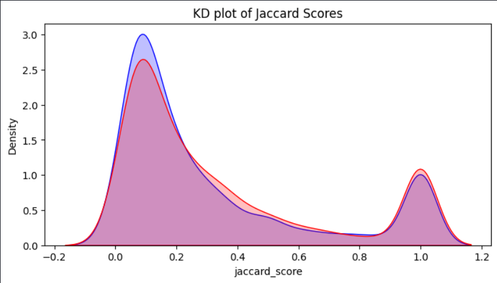
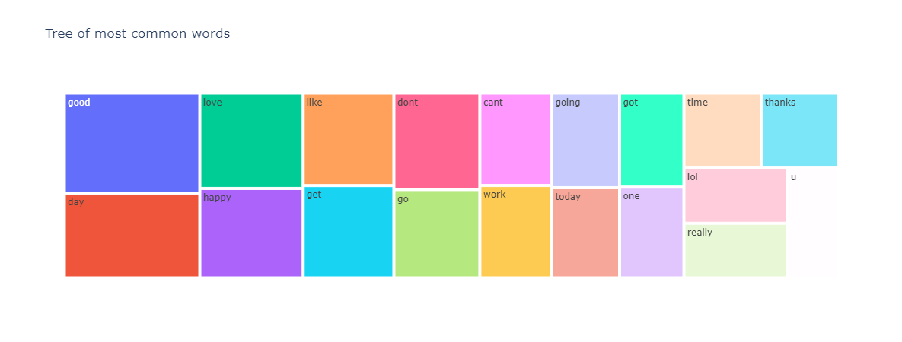
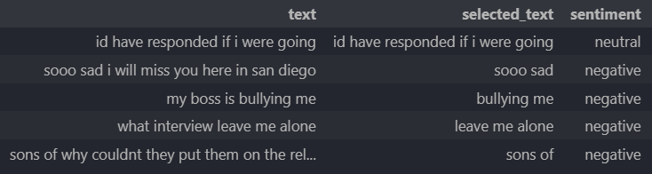

# Twitter-Sentiment-Analysis
Twitter Sentiment Analysis (TSA) is a powerful tool used to analyze and understand the sentiments expressed in tweets posted on the popular social media platform, Twitter. With over 330 million monthly active users, Twitter provides a rich source of real-time data that can be leveraged to gain insights into public opinion, trends, and attitudes.

TSA focuses on extracting and analyzing the part of the tweet that is relevant to the subject of interest, in this case, the TSA. It involves using natural language processing (NLP) techniques to identify and classify the sentiment associated with the extracted text. Sentiment analysis can help understand whether the sentiments expressed are positive, negative, or neutral towards the TSA.

 
 

## Observation
* Positive and Negative tweets have high kurtosis, and so the values are concentrated in two regions
* Neutral tweets have a low kurtosis, and their values are concentrated around 1

 
 

 
 

# Results

